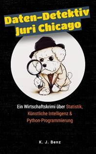

<html>

<head>
<meta http-equiv=Content-Type content="text/html; charset=windows-1252">
<meta name=Generator content="Microsoft Word 15 (filtered)">

</head>

<body lang=DE-CH link="#467886" vlink="#96607D" style='word-wrap:break-word'>

<h1>&#128269; Der
Code des Verbrechens</h1>

Ein Deal, der zu perfekt wirkt. Ein Unternehmer, der
misstrauisch wird. Und Zahlen, die Fragen aufwerfen.

<b>«Daten-Detektiv Juri Chicago» </b>ist mehr als ein Krimi.
Es ist ein Abenteuer in der Welt der Wirtschaft - spannend, klug und
überraschend erzählt.

Juri Chicago ist kein gewöhnlicher Detektiv. Er arbeitet mit
Zahlen, Statistiken, Logik und Python-Programmierung.

&#128073;
Ein <b>Wirtschaftskrimi, der Statistik und Programmierung für Kinder
spielerisch vermittelt</b>

&#128073;
Für<b> junge Entdeckerinnen und Entdecker von 9 bis 16 Jahren</b>

&#128073;
Spannend wie ein Thriller, lehrreich wie ein Geheimtraining fürs echte Leben

Während du liest, lernst du zu denken wie ein Detektiv:

Du erkennst Muster. Du hinterfragst Zahlen. Du kommst der
Wahrheit Schritt für Schritt näher.

&#128205;<b>
Jetzt auf der Leipziger Buchmesse erhältlich</b>

oder direkt online bestellen:

&#128073;
<a href="https://www.tiny-url.com/juri-textbuch">https://www.work-flow.consulting/daten-detektiv-juri-chicago</a>

<b>Kannst du den Code knacken, bevor Juri es tut?</b>

<h1>&#128269; Juri Chicago - Band 1: Big Katzis letzte Rechnung</h1>

<b></b>

Der große Erfolg des Buchs hat uns dazu veranlasst, <b>&quot;Juri
Chicago&quot; als Graphic Novel</b> neu aufzurollen.

<b>Exklusiv für die Buchmesse in Leipzig haben wir einen
Sonderdruck vom Juri Chicago-Comic angefertigt.</b>

<b>Das Buch kann unter folgender URL vorbestellt werden:</b>

<b><a href="https://progenia.ch/juri">https://progenia.ch/juri</a></b>

<b>&nbsp;</b>

<b>&nbsp;</b>

</body>

</html>
